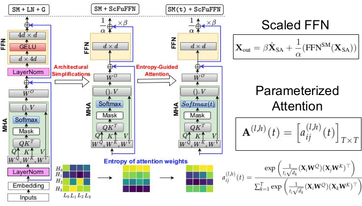

# Entropy-Guided Attention for Private LLMs

This is the official PyTorch implementation of our AAAI 2025 workshop (PPAI) paper "Entropy-Guided Attention for Private LLMs". 

Our entropy regularization module is designed to balance the entropy values of attention heads in the absence of crucial nonlinearities in LLMs, enhancing privacy while maintaining performance.


<p align="center">
     
     <br>
     <em>Entropy-guided Private LLM Design: Learnable-scaling in FFN prevents entropy collapse and parameterized-attention paired with entropy-regularization mitigates entropic overload.</em>
</p>


## Features

- Entropy calculation for attention matrices
- Configurable threshold-based entropy regularization
- Automatic context size detection (or manual configuration)
- Easy integration with Hugging Face Transformers
- Metrics logging for monitoring attention entropy

## Directory Structure

```
entropy-guided-attention-llm/
├── entropy_reg/
│   ├── __init__.py
│   └── entropy_regularization.py
├── examples/
│   └── usage_example.py
├── assets/
│   └── entropy_guided_attention.png
├── LICENSE
├── README.md
└── requirements.txt
```

## Installation

```bash
# Clone the repository
git clone https://github.com/Nandan91/entropy-guided-attention-llm.git
cd entropy-guided-attention-llm

# Install dependencies
pip install -r requirements.txt
```

## Usage

### Basic Usage

```python
from entropy_reg.entropy_regularization import EntropyRegularization

# Initialize regularizer
regularizer = EntropyRegularization(
    loss_coeff=1e-5,
    tolerance_margin_factor=0.20,
    context_size=1024  # Optional, inferred from attention matrices if not provided
)

# Get regularization loss (inside training loop)
entropy_reg_loss = regularizer.compute_loss(
    attentions=model_outputs.attentions,
    reg_threshold_weights=model.reg_threshold_weights,
    num_heads=model.config.n_head,
    num_layers=model.config.n_layer
)

# Combine with standard loss
total_loss = ce_loss + entropy_reg_loss
```

### Using with Hugging Face Transformers

See `examples/usage_example.py` for a complete example of using the entropy regularization module with the Hugging Face Transformers library.

## How It Works

The regularization loss is calculated as follows:

1. Calculate entropy for each attention matrix
2. Compare entropy to a learnable threshold for each head
3. Penalize deviations beyond a tolerance margin
4. Average penalties across heads and layers
5. Scale the final loss by a loss coefficient

By controlling attention entropy, models develop more balanced attention patterns that protect privacy without sacrificing performance.

## Parameters

- `loss_coeff`: Coefficient for the entropy regularization loss (default: 1e-5)
- `tolerance_margin_factor`: Fraction of max entropy to use as tolerance margin (default: 0.20)
- `context_size`: Size of the context window for calculating max entropy (optional, inferred from attention matrices if not provided)

## Paper Summary

For a video summary of our paper, check out the overview by Arxiv Papers:

[](https://www.youtube.com/watch?v=iX7dO8J7wuY)

## Citation

If you find this code or our paper useful in your research, please consider citing:

```bibtex
@article{jha2025entropy,
   title={Entropy-Guided Attention for Private LLMs},
   author={Jha, Nandan Kumar and Reagen, Brandon},
   journal={The 6th AAAI Workshop on Privacy-Preserving Artificial Intelligence},
   year={2025}
}
```

## Contributing

Contributions are welcome! Please feel free to submit a Pull Request.

## License

This project is licensed under the MIT License - see the LICENSE file for details.
